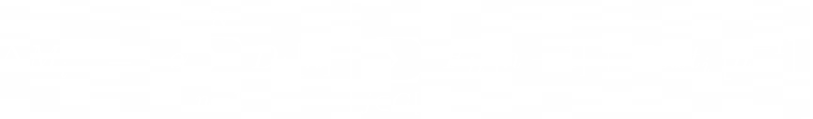

Язык разметки -- это способ записи текста в формате, который пригоден для машинной обработки, и часто содержит, помимо текста, инструкции по отображению этого текста.
Существует много различных языков разметки, которые работают хорошо для разных задач.

Мы будем рассматривать язык LaTeX, который чаще всего используется для написания научных работ.
Он является расширением языка верстки TeX, изобретенным Дональдом Кнутом в 1978 году.
Для вызова команд используется обратный слеш, а для указания аргументов -- фигурные скобки:

```tex
Этот текст \emph{выделен курсивом}.
Этот текст написан \textbf{жирным шрифтом}.
\begin{large}Этот текст больше обычного.\end{large}
\begin{Large}Этот текст ещё больше обычного.\end{Large}
\begin{LARGE}Этот текст ЕЩЁ больше обычного.\end{LARGE}
\begin{huge}Этот текст огромный.\end{huge}
\begin{Huge}Этот текст Огромный.\end{Huge}
```

Одна из самых известных способностей языка LaTeX -- это возможность вводить сложные математические формулы. Например, этот код:

```latex
\begin{equation}
\Delta M_i^{-1} = - \alpha \sum_{n=1}^N D_i \left[ n \right] \left[ \sum_{j \in C \left[ i \right]}^{} F_{ji} \left[ n -1 \right] + Fext_i \left[ n^{-1} \right] \right]
\end{equation}
```

...отображается следующим образом:



(Это выражение является названием [одного из треков композитора Aphex Twin](https://www.youtube.com/watch?v=M9xMuPWAZW8).)

Из-за этой возможности LaTeX остается золотым стандартом форматирования математических текстов, и часто другие среды создания документов (например Microsoft Word) копируют некоторые элементы синтаксиса.
Некоторые программы даже используют движок LaTeX как часть своей работы -- так, Pandoc использует его для преобразования документов в формат PDF, а [библиотека программируемых анимаций Manim](https://www.manim.community/) использует его для отображения математических формул в виде SVG.

LaTeX также имеет широкую стандартную библиотеку, которая позволяет использовать его для отображения картинок, графиков, блоков кода и многого другого. Таким образом, язык LaTeX является одним из важнейших языков разметки в сфере научных документов, и его стоит знать любому, кто планирует писать документы с математическими формулами или другими сложными элементами отображения.